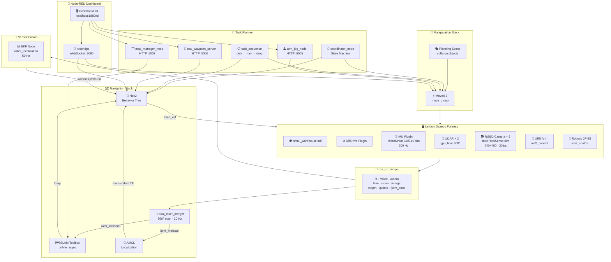
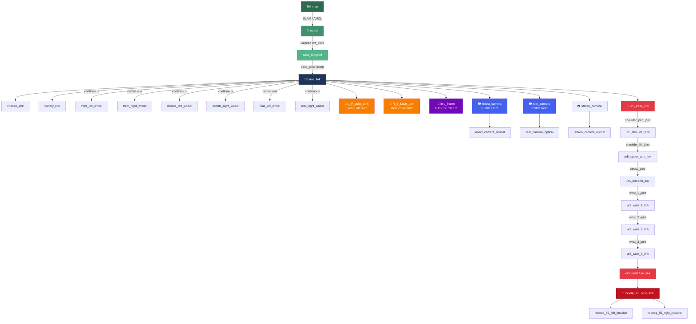
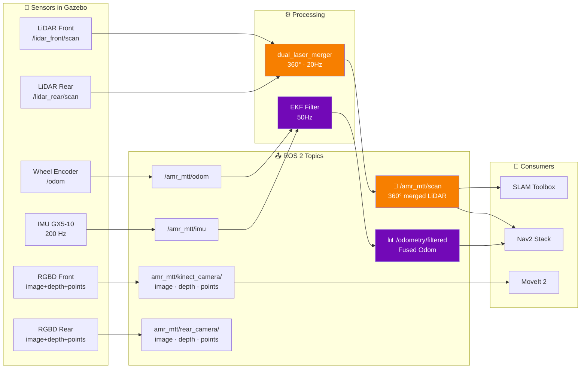
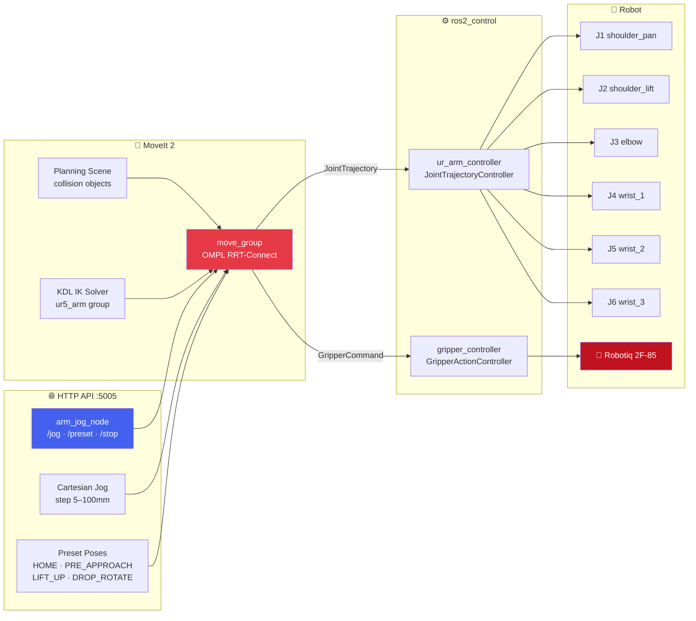
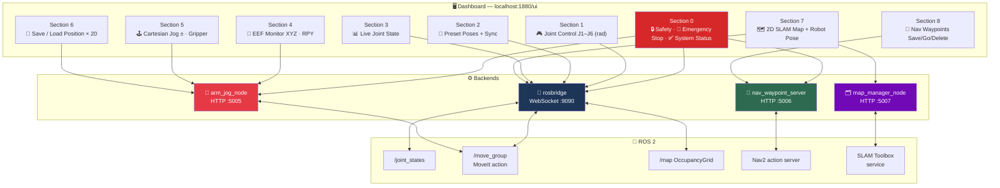
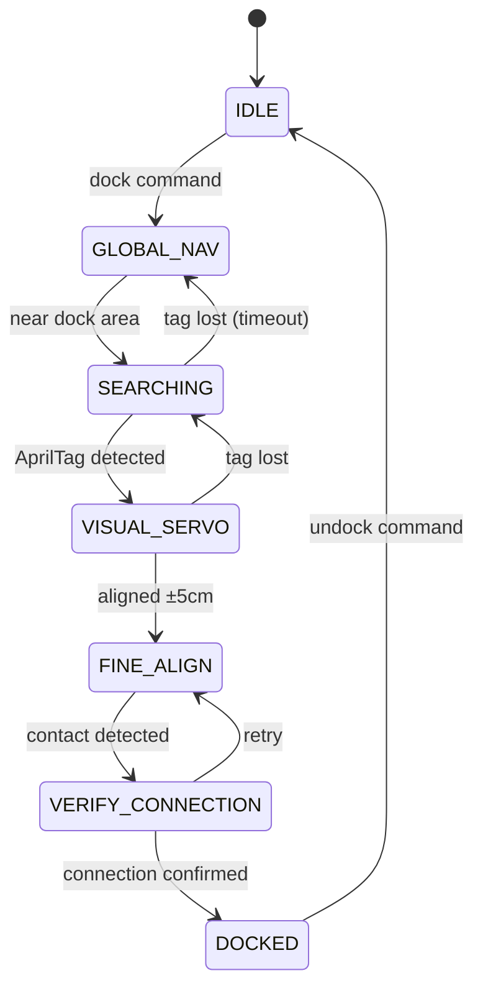
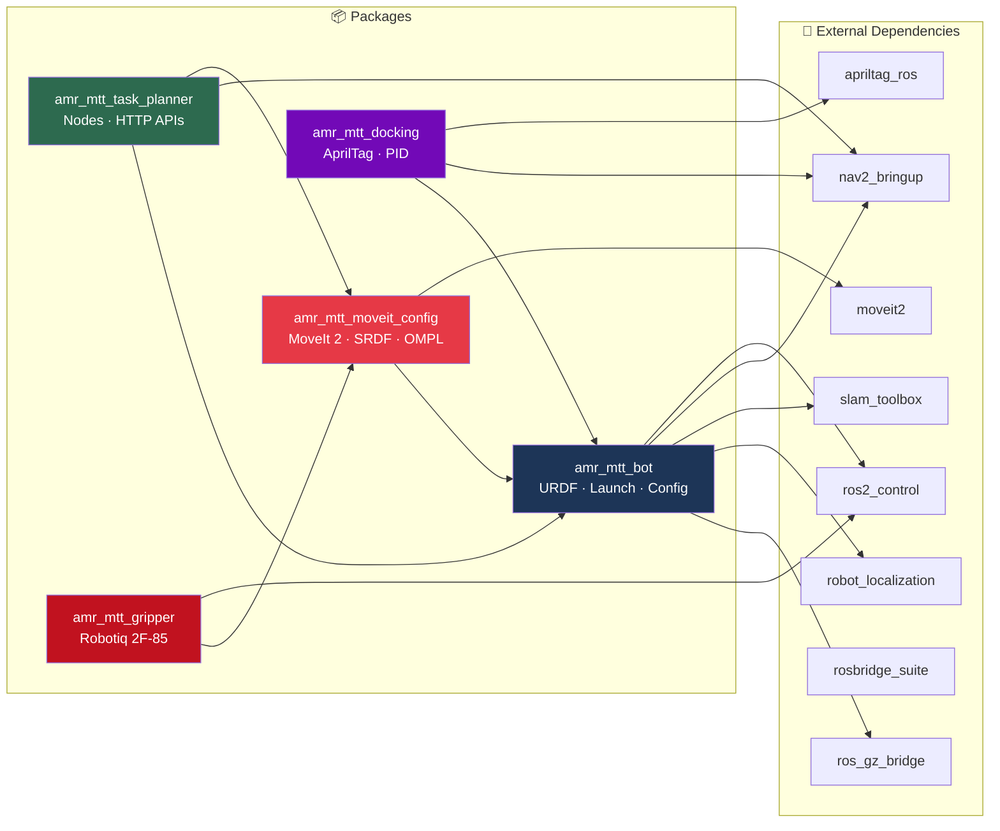

# AMR MTT — System Architecture

**Autonomous Mobile Robot with Manipulation**
*ROS 2 Humble · Ignition Gazebo Fortress · MoveIt 2 · Nav2*

---

## 1 · System Overview

---

## 2 · TF Transformation Tree

---

## 3 · Sensor Data Pipeline

---

## 4 · Navigation Data Flow

```mermaid
flowchart TD
    subgraph INPUT["Input"]
        SCAN_N["/amr_mtt/scan\n360° LiDAR"]
        ODOM_N["/odometry/filtered\nEKF Fused"]
        MAP_N["/map\nOccupancyGrid"]
    end

    subgraph NAV2_STACK["🧭 Nav2 Stack"]
        AMCL_N["AMCL\nLocalization\nmap→odom TF"]
        COSTMAP_G["Global Costmap\nNavfn Planner"]
        COSTMAP_L["Local Costmap\nDWB Controller"]
        BT["Behavior Tree\nbt_navigator"]
    end

    subgraph OUTPUT["Output"]
        CMDVEL["/cmd_vel"]
        RELAY["cmd_vel relay"]
        CTRL["/diff_drive_controller\n/cmd_vel_unstamped"]
    end

    SCAN_N --> AMCL_N
    ODOM_N --> AMCL_N
    AMCL_N --> MAP_N
    MAP_N --> COSTMAP_G
    SCAN_N --> COSTMAP_G
    SCAN_N --> COSTMAP_L
    COSTMAP_G --> BT
    COSTMAP_L --> BT
    BT --> CMDVEL
    CMDVEL --> RELAY
    RELAY --> CTRL

    style BT fill:#1d3557,color:#fff
    style AMCL_N fill:#2d6a4f,color:#fff
    style CMDVEL fill:#e63946,color:#fff
```

---

## 5 · Arm Manipulation Pipeline

---

## 6 · Node-RED Dashboard Architecture

---

## 7 · Auto-Docking State Machine

---

## 8 · Package Dependency Map

---

*AMR MTT — Bachelor of Engineering in Mechatronics Technology*
*College of Industrial Technology (CIT), KMUTNB*
*Developer: Phuwaset Sibta (MtT-13)*

