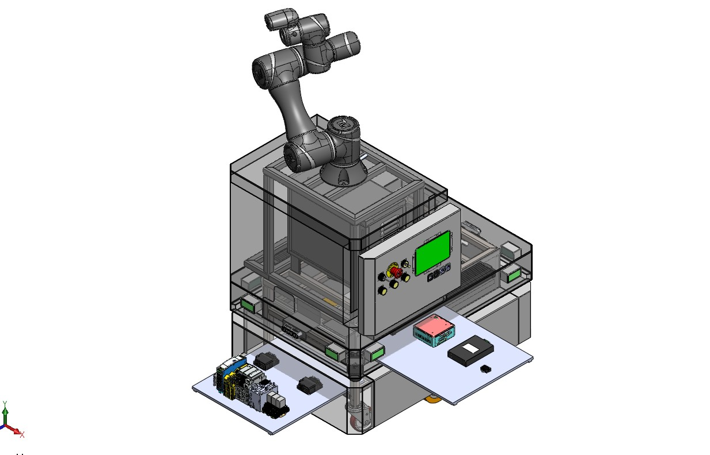
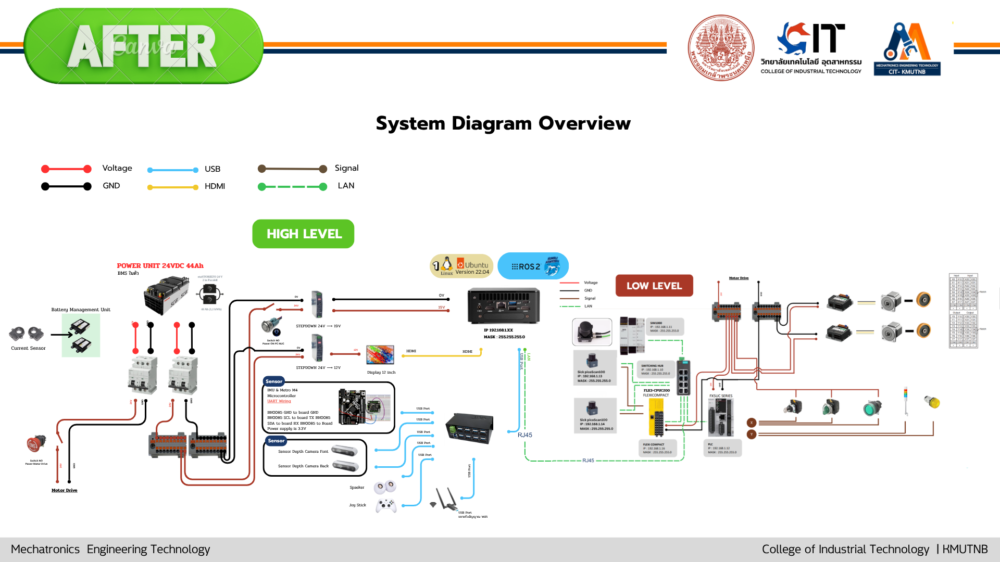

<div align="center">

# AMR MTT

### Autonomous Mobile Robot with Manipulation

*Final Project — Mechatronics Technology (MtT) | CIT, KMUTNB* <br>
*Mr. Phuwaset Sibta MtT-13<br>
Mr. Kittiphong Simak MtT-13<br>
Mr. Phupha Phungphadung MtT-13<br>


</div>

---
## Overview

## Contributors
* [@Phuwaset](https://github.com/Phuwaset) - Creator & Lead Developer & Leader Group.

* @Kittiphong - CAD amr_robot design



* @Phupha - Electrical Design Schematic & System Diagram of amr_robot


---
**AMR MTT** is an autonomous mobile robot developed as a final-year engineering project at King Mongkut's University of Technology North Bangkok (KMUTNB). The system integrates mobile navigation, robotic arm manipulation, gripper control, and automatic docking into a unified ROS 2 framework.

### Key Capabilities

- 🗺️ **Autonomous Navigation** — map-based path planning and obstacle avoidance via Nav2
- 🦾 **Arm Manipulation** — motion planning for a robotic arm using MoveIt! 2
- 🤏 **Gripper Control** — pick-and-place operations with a dedicated gripper package
- 🔌 **Auto Docking** — precision docking to a charging or handoff station

---

## Repository Structure

```
amr_mtt/
├── amr_mtt_bot/            # Core robot — URDF/Xacro model, launch files, controllers
├── amr_mtt_Gripper/        # Gripper driver and control nodes
├── amr_mtt_docking/        # Docking detection and alignment logic
└── amr_mtt_moveit_config/  # MoveIt! 2 configuration for arm motion planning
```

---

## Prerequisites

| Requirement | Version |
|---|---|
| Operating System | Ubuntu 22.04 LTS |
| ROS 2 | Humble Hawksbill |
| MoveIt! 2 | Latest (Humble) |
| Python | 3.10+ |

---

## Installation

```bash
# 1. Create a ROS 2 workspace
mkdir -p ~/ros2_ws/src
cd ~/ros2_ws/src

# 2. Clone this repository
git clone https://github.com/Phuwaset/amr_mtt.git

# 3. Install dependencies
cd ~/ros2_ws
rosdep install --from-paths src --ignore-src -r -y

# 4. Build the workspace
colcon build --symlink-install

# 5. Source the workspace
source install/setup.bash
```

---

## Usage

### Visualize Robot Model (URDF)
```bash
ros2 launch amr_mtt_bot display.launch.py
```

### Launch Full Navigation Stack
```bash
ros2 launch amr_mtt_bot navigation.launch.py
```

### Launch Arm Motion Planning (MoveIt!)
```bash
ros2 launch amr_mtt_moveit_config moveit.launch.py
```

### Launch Docking System
```bash
ros2 launch amr_mtt_docking docking.launch.py
```

### Launch Gripper Control
```bash
ros2 launch amr_mtt_Gripper gripper.launch.py
```

---

## Tech Stack

| Technology | Role |
|---|---|
| **ROS 2 Humble** | Robot middleware and communication framework |
| **Python / rclpy** | ROS 2 node development |
| **MoveIt! 2** | Arm motion planning and collision-aware control |
| **Nav2** | Autonomous mobile navigation stack |
| **URDF / Xacro** | Robot model description |
| **CMake** | Build system configuration |

---

## About

This project was developed as a final-year capstone project for the **Bachelor of Engineering in Mechatronics Technology (MtT)** program at the **College of Industrial Technology (CIT), King Mongkut's University of Technology North Bangkok (KMUTNB)**.

**Developer:** Phuwaset  
**Institution:** KMUTNB, Bangkok, Thailand

---

## License

This project is developed for academic and educational purposes as part of a final-year engineering project at KMUTNB. All rights reserved by the author.
