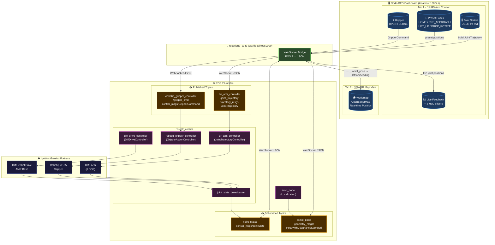
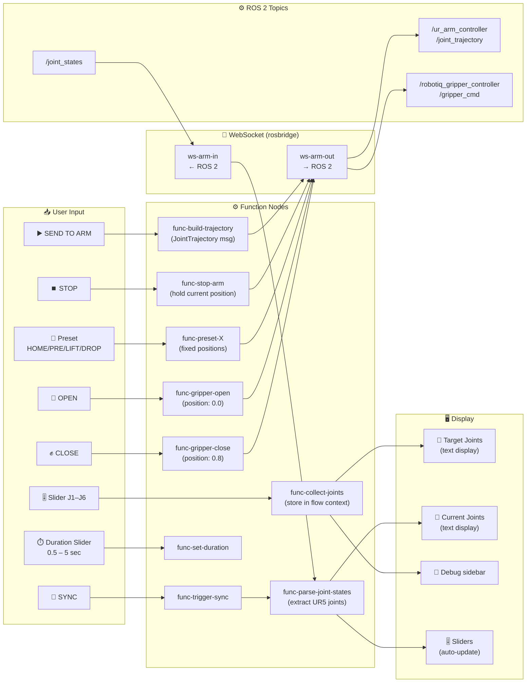
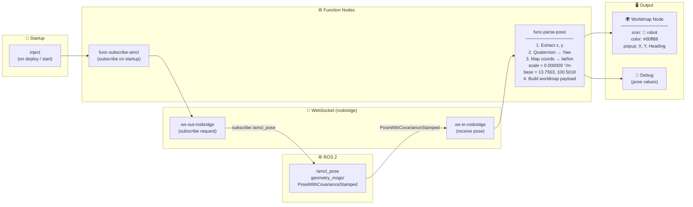
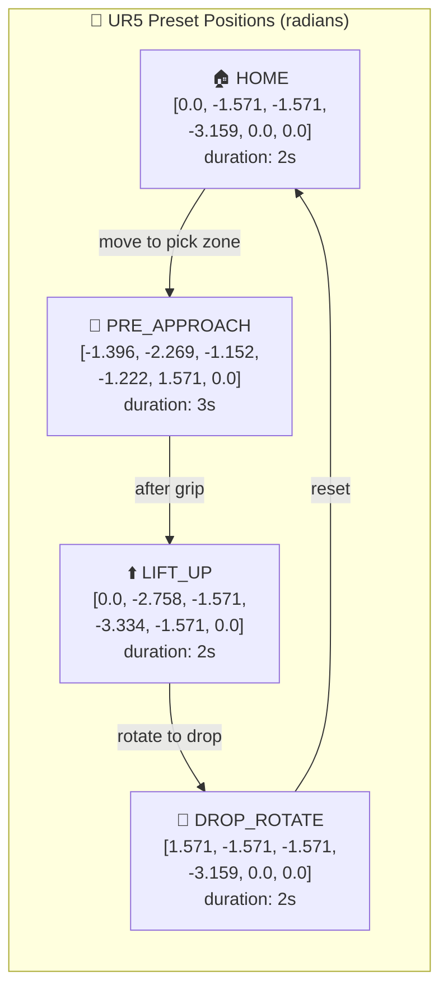

# Node-RED Architecture — AMR MTT

## 1. ภาพรวมระบบ (System Overview)

---

## 2. Flow A: arm_control_flow.json (Data Flow Detail)

---

## 3. Flow B: amr_map_flow.json (Data Flow Detail)

---

## 4. Preset Poses Reference

